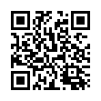
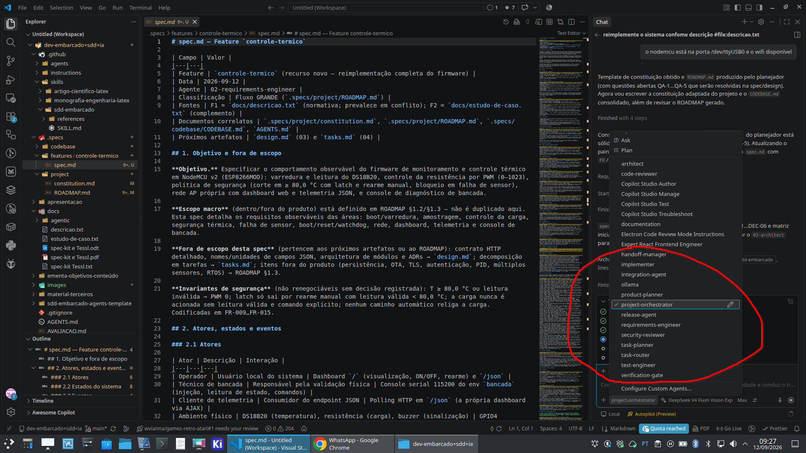
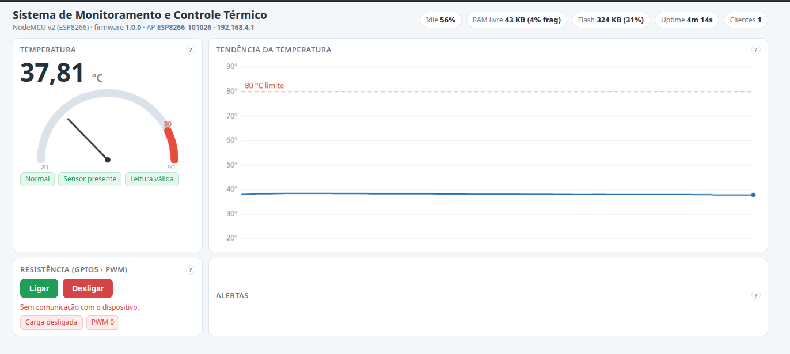

# Desenvolvimento de Software Embarcado com SDD e IA

Repositório de estudos, materiais didáticos e experimentos sobre desenvolvimento de software embarcado com apoio de IA e Specification-Driven Development (SDD). Diretório sdd-embarcado-agents-template/ contém skill, agentes e instruções para reutilizar em outros projetos embarcados. O estudo de caso principal é o **Sistema de Monitoramento e Controle Térmico** (NodeMCU v2 / ESP8266) com dashboard web embarcado, telemetria JSON, corte de carga em ≥ 80 °C, latch volátil e rearme manual.

Os experimentos foram conduzidos com perfis distintos dos agentes.

O material será usado nos componentes curriculares:

- Produtos Intensivos de Software do Instituto Federal Fluminense (IFF);
- Desenvolvimento de Software Embarcado Baseado em Especificação e Inteligência Artificial (optativa) do Instituto Federal Fluminense (IFF).

## Objetivo do repositório

O objetivo é mostrar como transformar necessidade de produto em comportamento verificável de firmware, mantendo rastreabilidade entre requisitos, design, implementação, testes e evidências.
No respositórios também existem documentos de referência sobre SDD, LLM, agentes, harness, artefatos e fluxo de desenvolvimento. Assim como, aprsentações e materiais de apoio para estudo e experimentação.

## Estrutura do repositório

- [.github/skills/sdd-embarcado/](.github/skills/sdd-embarcado/): skill para planejamento e implementação de firmware com SDD adaptativo.
- [firmware/](firmware/): firmware do estudo de caso (PlatformIO, NodeMCU v2/ESP8266) com lógica pura testável em host.
- [.specs/](.specs/): especificação, design, tarefas e evidências do estudo de caso.
- [sdd-embarcado-agents-template/](sdd-embarcado-agents-template/): extensão agêntica (agentes, instruções e protocolo de contexto) pronta para reutilizar em outros projetos.
- [AGENTS.md](AGENTS.md): regras permanentes do projeto para agentes de IA.
- [apresentação/](apresentacao/): materiais da palestra e conteúdo introdutório (LLM, SDD, fluxo prático no VS Code).
- [docs/](docs/): notas sobre ferramentas e abordagens (Spec Kit, Tessl), documentação do fluxo agentic e estudo de caso.
- [material-terceiros/](material-terceiros/): materiais de apoio externos.
- [ementa-objetivos-conteúdo/](ementa-objetivos-conte%C3%BAdo/): conteúdo programático, bibliografia e ementa da disciplina.

## Agentes do fluxo SDD

A implementação deste estudo de caso foi conduzida com o fluxo agêntico do repositório — os agentes estão definidos em [.github/agents/](.github/agents/) e a extensão reutilizável está em [sdd-embarcado-agents-template/](sdd-embarcado-agents-template/). Cada etapa tem um agente especializado (roteamento, produto, requisitos, arquitetura, tarefas, implementação, revisão de código, testes, segurança, documentação, integração, release, verificação e handoff). A figura abaixo apresenta a listagem e o perfil dos agentes utilizados.

## Abordagem SDD para embarcados

O fluxo recomendado neste repositório:

1. definir problema, restrições e critérios de aceitação;
2. explicitar requisitos funcionais e não funcionais;
3. projetar arquitetura compatível com MCU, periféricos e timing;
4. quebrar em tarefas pequenas e verificáveis;
5. implementar com assistência de IA;
6. validar em host, bancada e/ou HIL;
7. registrar evidências de teste e decisões técnicas;
8. documentar e manter a documentação atualizada.

Esse modelo evita dois extremos: codificar sem especificação e burocratizar mudanças simples. A profundidade do processo deve acompanhar risco, criticidade e impacto da alteração.

### Mapa de artefatos

Os artefatos têm funções complementares:

- **Specification:** define o que deve ser construído e funciona como contrato do software;
- **Architecture / Design:** organiza camadas, módulos, interfaces e dependências;
- **Plan / Task:** transforma a especificação em trabalho executável e incremental;
- **Rules:** registra restrições permanentes, como “usar MISRA-C; nunca usar `malloc`”;
- **Skills:** orienta procedimentos especializados, como implementar um driver SPI;
- **Context:** reúne MCU, SDK, pinout, datasheet, toolchain e limitações de hardware;
- **Tests / Checks:** verificam comportamento por meio de testes unitários, HIL, análise estática e timing;
- **Acceptance Criteria:** define quando o requisito pode ser considerado concluído;
- **Interfaces / Contracts, ADRs e Examples:** preservam contratos, decisões e padrões de implementação;
- **Quality Gates:** impedem concluir a tarefa sem build, testes e evidências suficientes;
- **Harness:** fornece ao agente contexto, ferramentas, compilador, Git, testes e feedback.

Em resumo: a Specification define o contrato; Architecture organiza o sistema; Plan e Task orientam a execução; os demais artefatos fornecem restrições, conhecimento, padrões e evidências.

## Demonstração prática da palestra

Na apresentação principal ([sdd_software_embarcado.md](https://github.com/wvianna/dev-embarcado-sdd-ia/blob/main/apresentacao/sdd_software_embarcado.md)), o conteúdo inclui fundamentos de LLM, harness, SDD adaptativo, artefatos, MCU, hardware, RTOS, rastreabilidade e uma demonstração prática com:

- ESP8266 em modo AP;
- SSID baseado no MAC;
- rede aberta com IP fixo do MCU em 192.168.4.1/24;
- leitura de temperatura com DS18B20 em D2/GPIO4;
- leitura analógica em A0 (0 a 1023);
- dashboard web embarcado exibindo valores em tempo real;
- indicação numérica, gauge e gráfico de tendência da temperatura (20–40 °C), além de gauge e tendência do ADC (0–1023).

O firmware deste repositório implementa o sistema de monitoramento e controle térmico descrito em [docs/descricao.txt](docs/descricao.txt): AP aberto com SSID derivado do MAC, IP fixo 192.168.4.1/24 com DHCP, dashboard web em pt-BR (gauge e gráfico de tendência com escala fixa de 20–90 °C, botão liga/desliga da resistência, alertas e rearme do alarme) e telemetria JSON em `/json`. A segurança térmica corta a carga em ≥ 80,0 °C com latch e rearme manual, bloqueia a carga sem leitura válida e mantém amostragem de 1,2 s ± 150 ms (leitura vinculada à ROM do DS18B20 identificada no boot) sem bloquear o loop. Comandos principais: `pio run -d firmware` (build), `pio test -d firmware -e native` (testes HOST) e gravação em `/dev/ttyUSB0` (ver [AGENTS.md](AGENTS.md) §4).

*Dashboard servida pelo próprio ESP8266 no AP (`192.168.4.1`): gauge e valor de temperatura (escala fixa de 20–90 °C), tendência com linha de limite de 80 °C, controles da resistência (PWM) e painel de alertas.*

### Estudos de caso

Os estudos de caso abaixo aplicam a mesma abordagem SDD da skill [sdd-embarcado](.github/skills/sdd-embarcado/SKILL.md), com especificação, design, planejamento, implementação, testes e documentação em um fluxo rastreável.

- **DeepSeek V4 Flash** na especificação e implementação do dashboard web embarcado em ESP8266: [demonstracao-dashboarweb-termico](https://github.com/wvianna/demonstracao-dashboarweb-termico).
- **Claude Sonnet 5** na especificação e implementação: [dev-embarcado-sdd-ia-sonnet-5](https://github.com/wvianna/dev-embarcado-sdd-ia-sonnet-5).
- **Copilot Auto** (roteamento do modelo) na especificação e implementação: [dev-embarcado-sdd-ia-copilot-auto](https://github.com/wvianna/dev-embarcado-sdd-ia-copilot-auto).
- **Qwen 3.8 2.4T + Deepseek V4 Flash Vision** (roteamento do modelo) na especificação e implementação: [dev-embarcado-sdd-ia-qwen3.8-2.4T-DeepseekV4-flash-vison](https://github.com/wvianna/dev-embarcado-sdd-ia-qwen3.8-2.4T-DeepseekV4-flash-vison).

Em **todo o processo** (especificação, design, planejamento de tarefas, implementação do firmware, testes e documentação), cada estudo foi conduzido com o modelo de IA indicado acima.

A implementação principal segue o processo SDD da skill em [firmware/](firmware/), com especificação, design e tarefas em [.specs/features/controle-termico/](.specs/features/controle-termico/) e evidências de validação em [docs/05-testing/controle-termico/](docs/05-testing/controle-termico/).

## Use a skill sdd-embarcado

Para o escopo local da Skill, copie o diretório .github para o projeto dentro do seu workspace do VS Code. A skill fornece templates de artefatos, exemplos de tarefas e critérios de aceitação, além de instruções para build, flash e teste.

Faça uma descrição do problema, requisitos e critérios de aceitação, e use a skill para gerar artefatos de design, tarefas e testes. A skill também orienta a implementação com assistência de IA, validação em host ou HIL e registro de evidências.

Analise com cuidado os artefatos gerados. A skill não substitui o julgamento do engenheiro e/ou especialista. Conheça o hardware, datasheet, SDK e toolchain do projeto-alvo antes de usar a skill. A skill não garante que o firmware esteja correto ou seguro.

Para implementar firmware com rastreabilidade, use a skill:

- [SKILL.md](.github/skills/sdd-embarcado/SKILL.md)

Quando usar:

- início de uma nova feature embarcada;
- definição de tratamento de falhas e requisitos de tempo real;
- planejamento de tarefas e critérios de verificação;
- preparação de validação em bancada ou HIL.

Material de apoio da skill:

- [constitution.md](.github/skills/sdd-embarcado/references/constitution.md)

## Observações

Este repositório é majoritariamente educacional. Comandos de build, flash e teste variam conforme placa, SDK e toolchain do projeto-alvo.

## Licença

Copyright 2026 William da Silva Vianna

Licensed under the Apache License, Version 2.0 (the "License");
you may not use this file except in compliance with the License.
You may obtain a copy of the License at

    http://www.apache.org/licenses/LICENSE-2.0

Unless required by applicable law or agreed to in writing, software
distributed under the License is distributed on an "AS IS" BASIS,
WITHOUT WARRANTIES OR CONDITIONS OF ANY KIND, either express or implied.
See the License for the specific language governing permissions and
limitations under the License.
