# Do Zero ao LLM Local
## Como um modelo de linguagem é construído, treinado e executado

> Material de apoio e demonstração prática.
>
> **Objetivo:** explicar o caminho entre dados brutos, treinamento de um modelo de linguagem e execução local, diferenciando claramente **treinamento do zero**, **fine-tuning** e **RAG**.

---

## 1. Objetivos da palestra

Ao final, o público deverá compreender:

- o que é um token;
- como um texto é transformado em números;
- o papel de embeddings, atenção e Transformers;
- o que significa treinar um LLM;
- por que treinar do zero é muito diferente de fazer fine-tuning;
- como um modelo pequeno pode ser treinado localmente;
- como ferramentas como Ollama entram no processo;
- quando usar treinamento, fine-tuning ou RAG.

---

## 2. Roteiro

1. O que é um LLM?
2. Tokens: do texto aos números
3. Embeddings e representação vetorial
4. Transformer e self-attention
5. O ciclo de treinamento
6. Treinamento do zero × fine-tuning × RAG
7. Infraestrutura: CPU, GPU, RAM e VRAM
8. Demonstração: um modelo pequeno treinado do zero
9. Fine-tuning de um modelo existente
10. Execução local com Ollama
11. Limitações e conclusões

---

# 3. O que é um LLM?

Um Large Language Model é, essencialmente, uma rede neural treinada para aprender padrões estatísticos de linguagem.

Uma formulação simplificada:

> Dado um contexto, o modelo aprende a estimar qual token tem maior probabilidade de aparecer em seguida.

Exemplo:

```text
O Brasil é um país da América
                         ↓
                      [Latina]
```

O modelo não "consulta uma tabela" para responder. Ele calcula probabilidades a partir dos parâmetros aprendidos.

---

# 4. Tokens

Um token é uma unidade usada pelo modelo para representar texto.

Dependendo do tokenizador, uma palavra pode virar:

- um token;
- vários tokens;
- parte de uma palavra;
- pontuação ou símbolos.

Exemplo ilustrativo:

```text
"Olá, mundo!"

→ ["Olá", ",", " mundo", "!"]
```

Os tokens são convertidos em identificadores numéricos:

```text
["Olá", ",", " mundo", "!"]
       ↓
[3812, 17, 9045, 32]
```

> **Observação:** os números acima são apenas ilustrativos.

---

# 5. Do texto ao modelo

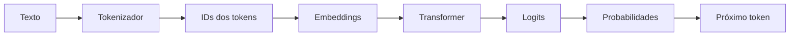

O ciclo se repete durante a geração:

```text
contexto → próximo token → contexto ampliado → próximo token → ...
```

---

# 6. Embeddings

O ID de um token é apenas um índice.

O modelo precisa transformar esse índice em uma representação vetorial:

```text
Token
  ↓
Embedding
  ↓
[0.13, -0.72, 0.44, ...]
```

O embedding permite que o modelo trabalhe matematicamente com relações entre tokens.

Uma ideia importante para apresentar:

> **O significado não está no número do token. Está na representação aprendida pelo modelo.**

---

# 7. Transformer

A arquitetura Transformer revolucionou o processamento de linguagem porque permite relacionar diferentes partes de uma sequência de forma eficiente.

Uma visão simplificada:

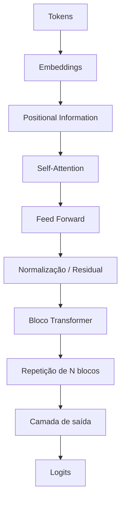

---

# 8. Self-Attention

A pergunta central é:

> **Quais partes do contexto são importantes para interpretar este token?**

Exemplo:

```text
"O animal não atravessou a rua porque ele estava cansado."
                                  ↑
                                  │
                    Quem é "ele"?
```

A atenção permite ao modelo atribuir diferentes pesos às partes do contexto.

Conceitualmente:

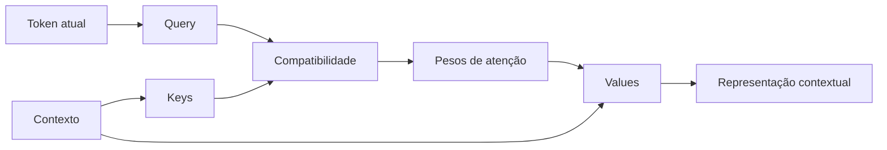

---

# 9. Treinamento: a ideia fundamental

No treinamento, apresentamos ao modelo exemplos de texto.

Exemplo:

```text
Entrada:
"O gato subiu no"

Resposta esperada:
"telhado"
```

O modelo faz uma previsão.

```text
Previsão:
"sofá"

Esperado:
"telhado"
```

Calculamos uma função de perda (*loss*).

O objetivo é ajustar os parâmetros para reduzir essa perda.

---

# 10. Backpropagation

O ciclo básico:

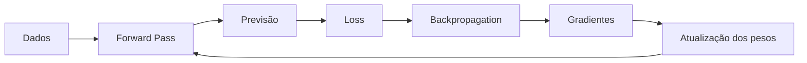

Em termos simplificados:

```text
dados
  ↓
previsão
  ↓
erro
  ↓
gradientes
  ↓
ajuste dos pesos
  ↓
nova previsão
```

Esse processo é repetido milhões ou bilhões de vezes em modelos grandes.

---

# 11. O que está sendo aprendido?

O treinamento altera os parâmetros da rede.

Uma forma simplificada de pensar:

```text
Modelo inicial
      ↓
Parâmetros aleatórios
      ↓
Treinamento
      ↓
Padrões estatísticos
      ↓
Modelo treinado
```

O modelo aprende regularidades presentes nos dados:

- sintaxe;
- relações entre palavras;
- padrões de escrita;
- fatos presentes nos dados;
- estruturas de código;
- padrões matemáticos;
- relações semânticas.

---

# 12. Treinar do zero

Treinar do zero significa começar sem um modelo linguístico previamente treinado.

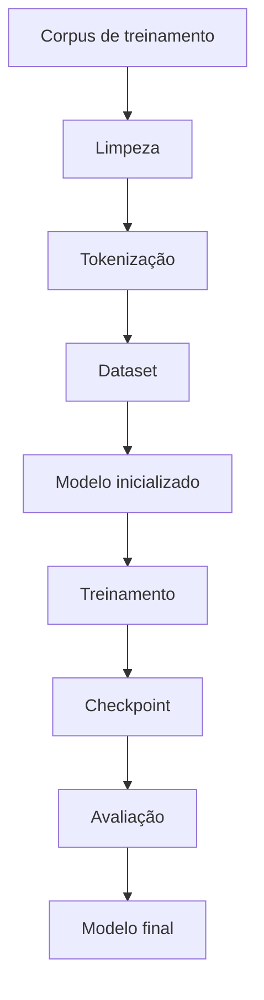

Isso envolve:

- definir arquitetura;
- definir tokenizer;
- preparar dataset;
- inicializar pesos;
- treinar;
- avaliar;
- salvar checkpoints;
- repetir até atingir o objetivo.

---

# 13. Fine-tuning

No fine-tuning, partimos de um modelo já treinado.

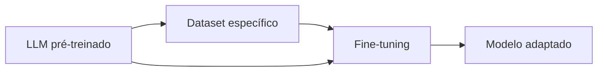

Exemplo:

```text
Modelo geral
      +
documentos técnicos
      ↓
Modelo especializado
```

Isso costuma exigir muito menos computação do que treinar um modelo equivalente do zero.

---

# 14. LoRA e QLoRA

Em vez de alterar todos os parâmetros do modelo, técnicas como LoRA treinam pequenas matrizes adicionais.

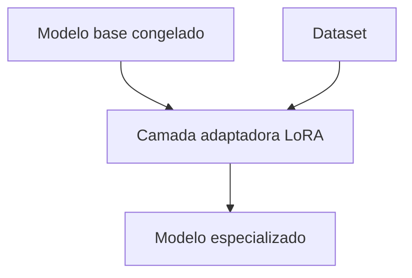

Ideia:

```text
Modelo base
   │
   ├── parâmetros congelados
   │
   └── pequenos adaptadores treináveis
```

**QLoRA** combina a ideia de LoRA com quantização do modelo base, reduzindo ainda mais o uso de memória em determinados cenários.

---

# 15. RAG

RAG significa **Retrieval-Augmented Generation**.

Em vez de modificar o modelo, fornecemos informações relevantes no contexto da pergunta.

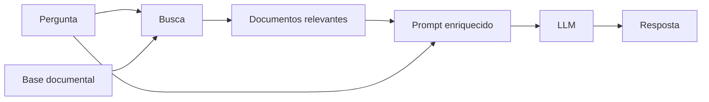

Regra prática:

| Necessidade | Estratégia |
|---|---|
| Criar um modelo novo | Treinamento do zero |
| Adaptar comportamento/conhecimento | Fine-tuning |
| Consultar documentos atualizados | RAG |
| Personalizar estilo/formato | Fine-tuning ou prompt |
| Rodar modelo localmente | Inferência |

---

# 16. Treinamento × inferência

São problemas diferentes.

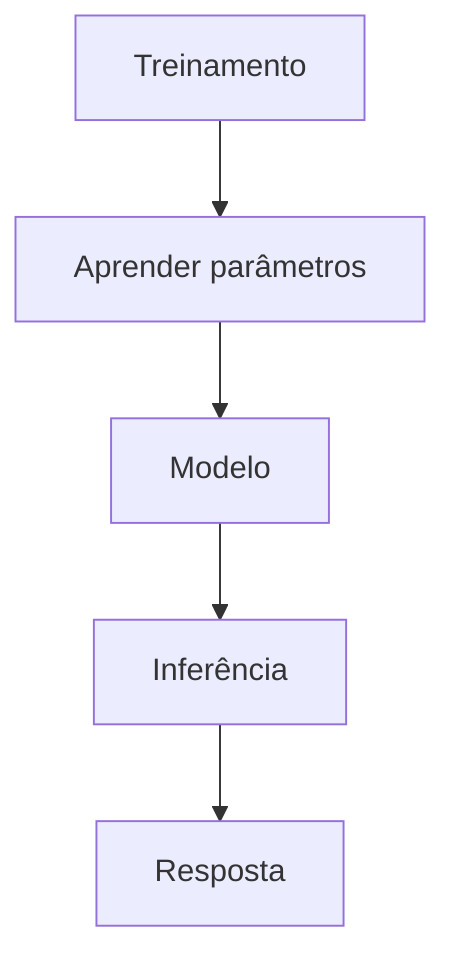

### Treinamento

- alto consumo de GPU;
- cálculo de gradientes;
- atualização de pesos;
- geralmente muito mais caro.

### Inferência

- pesos já estão prontos;
- não há atualização do modelo;
- foco em gerar respostas;
- pode ser feita em hardware muito mais modesto.

---

# 17. CPU, GPU, RAM e VRAM

Uma explicação prática:

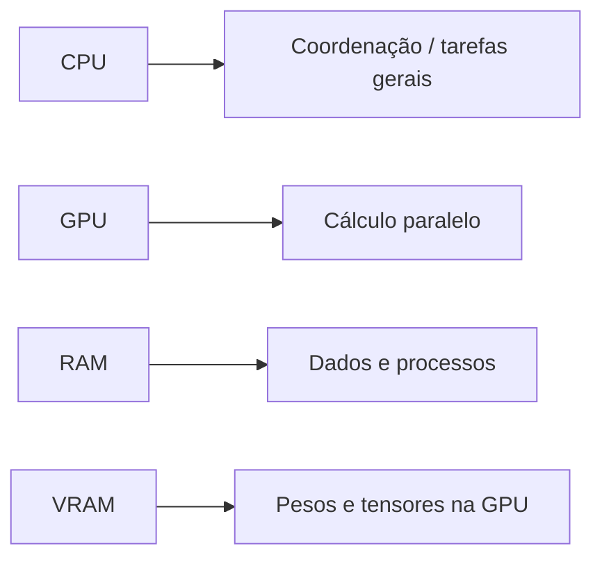

Para treinamento de redes neurais, a GPU é especialmente importante porque consegue executar grandes quantidades de operações matriciais em paralelo.

---

# 18. Por que modelos maiores exigem mais memória?

Uma aproximação simples:

```text
Memória dos pesos ≈ número de parâmetros × bytes por parâmetro
```

Exemplo:

```text
7 bilhões de parâmetros
× 2 bytes
≈ 14 GB
```

Isso representa apenas uma aproximação para os pesos em 16 bits.

Durante o treinamento, podem existir ainda:

- gradientes;
- estados do otimizador;
- ativações;
- buffers;
- dados adicionais.

Por isso, **treinar** exige muito mais memória do que simplesmente armazenar os pesos.

---

# 19. Quantização

Quantização reduz a precisão numérica usada para representar os pesos.

Exemplo conceitual:

```text
FP32 → FP16 → INT8 → INT4
```

Quanto menor a representação:

- menor uso de memória;
- potencialmente maior eficiência;
- possível perda de qualidade, dependendo do modelo e método.

---

# 20. Ollama

O Ollama é especialmente útil para a parte de **execução local**.

A ideia:

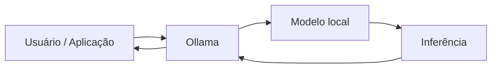

Uma distinção importante para a palestra:

> **Ollama é principalmente uma ferramenta de execução/gerenciamento de modelos; ele não substitui o pipeline de treinamento de um LLM do zero.**

Para treinamento, podemos utilizar frameworks como PyTorch e ferramentas especializadas.

---

# 21. Demonstração prática — modelo pequeno do zero

A demonstração pode usar um corpus pequeno e controlado.

Objetivo:

> Treinar um modelo mínimo para demonstrar o mecanismo, e não competir com um LLM comercial.

Pipeline:

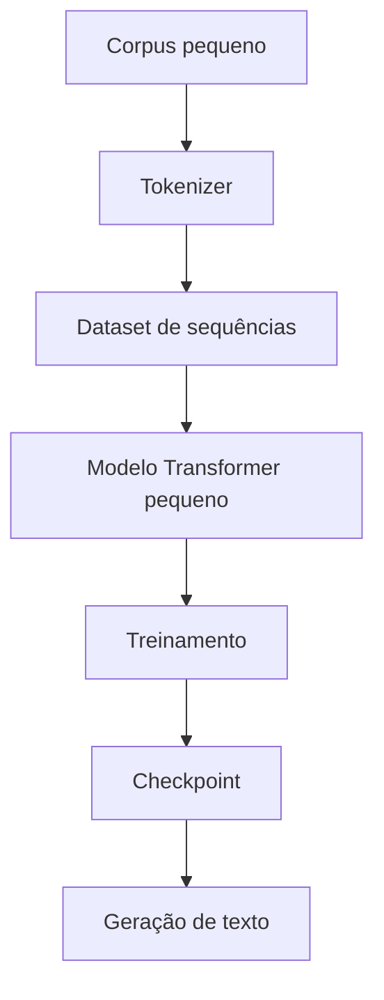

---

# 22. O experimento

### Etapa 1 — Corpus

Criar um conjunto pequeno de textos.

### Etapa 2 — Tokenização

Transformar os textos em tokens.

### Etapa 3 — Dataset

Criar pares:

```text
contexto → próximo token
```

### Etapa 4 — Modelo

Um Transformer propositalmente pequeno.

### Etapa 5 — Treinamento

Executar várias épocas.

### Etapa 6 — Geração

Testar prompts que não estavam literalmente presentes no treinamento.

---

# 23. O que esperamos observar?

No início:

```text
Modelo:
"Casa azul peixe computador..."
```

Depois do treinamento:

```text
Modelo:
"o sistema possui sensores..."
```

A qualidade dependerá diretamente:

- da quantidade de dados;
- da qualidade dos dados;
- da arquitetura;
- do tokenizer;
- do número de parâmetros;
- do tempo de treinamento.

---

# 24. Demonstração 2 — Fine-tuning

Depois do modelo mínimo, apresentar a diferença:

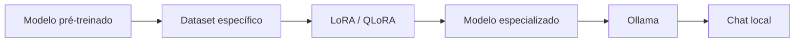

Aqui o público verá uma situação muito mais próxima do uso profissional.

---

# 25. O que NÃO é treinamento do zero?

É importante desfazer alguns conceitos.

### Não é treinamento do zero:

```text
baixar um modelo
+
criar um Modelfile
+
executar no Ollama
```

Isso é principalmente **configuração e inferência**.

Também não é treinamento do zero:

```text
modelo existente
+
LoRA
```

Isso é **adaptação/fine-tuning**.

---

# 26. Três níveis de personalização

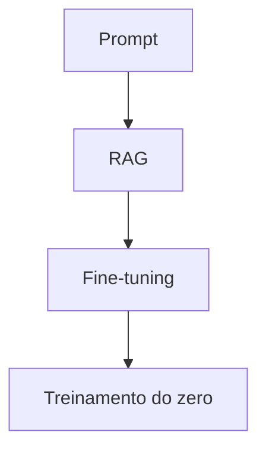

Da menor para a maior alteração:

1. Prompt engineering
2. RAG
3. Fine-tuning / LoRA
4. Treinamento do zero

Quanto mais profundo o nível, maior tende a ser:

- custo;
- complexidade;
- necessidade de dados;
- necessidade de infraestrutura.

---

# 27. Uma analogia para o público

Imagine uma pessoa aprendendo uma profissão.

### Prompt

Dar uma instrução para alguém que já sabe trabalhar.

### RAG

Entregar um manual para consulta.

### Fine-tuning

Enviar a pessoa para uma especialização.

### Treinamento do zero

Ensinar desde a alfabetização até a profissão.

---

# 28. Pipeline completo

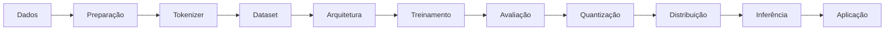

---

# 29. Mensagem principal

> **Um LLM não é uma biblioteca de respostas.**
>
> É uma rede neural que aprendeu parâmetros a partir de grandes quantidades de exemplos.

E:

> **Usar um modelo, adaptar um modelo e treinar um modelo são três problemas diferentes.**

---

# 30. Conclusão

A palestra deve terminar reforçando:

- Tokens transformam linguagem em unidades manipuláveis.
- Embeddings transformam tokens em representações vetoriais.
- Transformers processam relações contextuais.
- O treinamento ajusta parâmetros através do erro.
- Fine-tuning adapta um modelo existente.
- LoRA/QLoRA tornam essa adaptação mais acessível.
- RAG adiciona conhecimento externo sem necessariamente alterar os pesos.
- Ollama facilita a execução local.
- Um modelo pequeno pode ser treinado do zero para demonstrar o mecanismo.
- Produzir um LLM competitivo do zero é um problema de escala completamente diferente.

---

# 31. Frase final

> **"A melhor forma de entender um LLM não é apenas conversar com ele. É construir um pequeno e observar como ele aprende."**

---

# 32. Checklist da demonstração

- [ ] Preparar corpus pequeno
- [ ] Definir tokenizer
- [ ] Criar dataset
- [ ] Implementar/carregar Transformer mínimo
- [ ] Treinar modelo
- [ ] Salvar checkpoint
- [ ] Demonstrar geração antes/depois
- [ ] Mostrar fine-tuning
- [ ] Exportar/empacotar modelo compatível com execução local quando aplicável
- [ ] Demonstrar Ollama
- [ ] Comparar treinamento do zero, fine-tuning e RAG

---

## Apêndice — Conceitos matemáticos mínimos

### Probabilidade do próximo token

O modelo estima:

```text
P(token seguinte | contexto)
```

### Loss

Uma formulação comum para linguagem é a cross-entropy:

```text
L = - Σ yᵢ log(pᵢ)
```

onde:

- `yᵢ` representa o alvo;
- `pᵢ` representa a probabilidade prevista.

### Atualização dos parâmetros

Uma forma simplificada:

```text
θₙₑw = θₒₗd - η ∇L
```

onde:

- `θ` = parâmetros;
- `η` = taxa de aprendizado;
- `∇L` = gradiente da perda.

---

## Apêndice — Diagrama geral da palestra

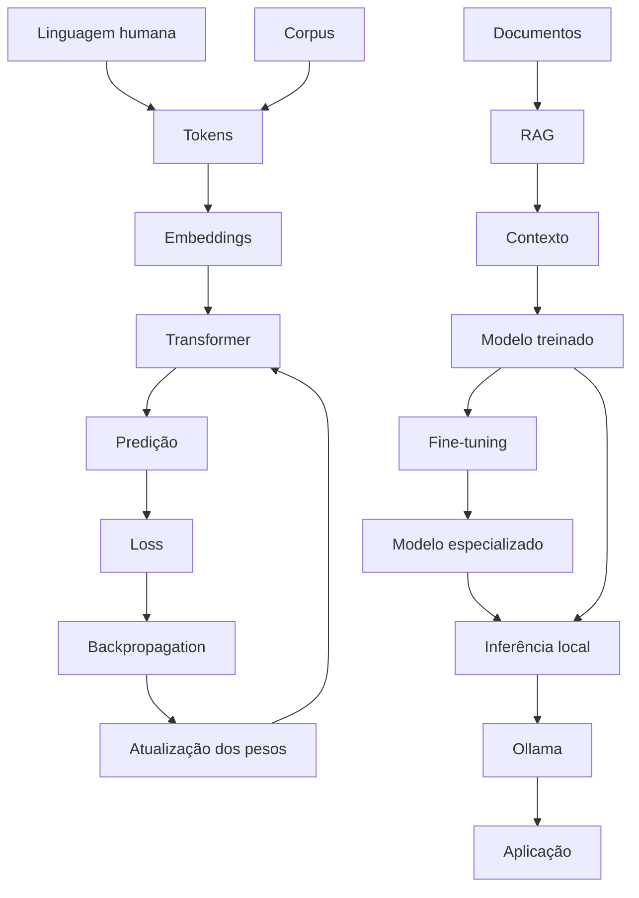
