# SDD para Software Embarcado
## Da especificação ao firmware em microcontroladores

**Palestra:** desenvolvimento orientado a especificações com apoio de LLMs  
**Ambiente:** VS Code + arquivos `.md` + Git  
**Foco:** firmware, drivers, RTOS, testes e validação

> **Mensagem central:** SDD não elimina engenharia. Ele torna a intenção, as decisões, as restrições e as evidências explícitas e rastreáveis.

---

# 1. O que será apresentado

- O que são **LLM, tokens, janela de contexto e custo**
- Execução de LLM **local × provedor remoto**
- O que é **harness** e como ele fecha o ciclo entre intenção e evidência
- O conceito de **SDD — Specification-Driven Development** e seu uso adaptativo
- O papel dos artefatos: **Specification, Architecture, Plan, Task, Rules, Skills e Context**
- Como usar `SKILL.md` e `constitution.md` para orientar a implementação no VS Code
- A importância dos fundamentos de MCU, hardware, interfaces, RTOS, timing, memória, energia e falhas no contexto de SDD
- Como transformar uma funcionalidade em especificação, design, tarefas, código, testes e evidências
- Como garantir rastreabilidade, contratos, ADRs, exemplos e quality gates
- Como distinguir **HOST, SIMULADOR, BANCADA e HIL**
- Demonstração prática: **ESP8266 em modo AP**, DS18B20 no D2/GPIO4, leitura de A0 e dashboard web embarcado

---

# 2. Uma provocação (apêndice A)

## "Se a IA escreve o código, o programador acabou?"

**Não.**

Em software embarcado, a pergunta correta é:

> **Quem definiu o comportamento que o código deve implementar?**

E ainda:

- Quais são os limites?
- Qual é o timing?
- O que acontece quando o sensor falha?
- O que acontece no reset?
- Quanto de RAM pode ser usado?
- Quanto de flash pode ser consumido?
- Qual é o estado seguro?
- Como provar que o código funciona no alvo?

**SDD muda o foco de "pedir código" para "definir e verificar comportamento".**

**Ler datasheet é essencial — ou pedir para uma IA auxiliar na interpretação.**

***A IA pode escrever o código. O engenheiro continua responsável por definir o comportamento, as restrições e as evidências necessárias para afirmar que o código está correto.***

---

# 3. LLM: o que é?

## Large Language Model

Um LLM é um modelo treinado para trabalhar com sequências de tokens e prever continuações plausíveis.


### Para software embarcado

A LLM pode:

- interpretar uma especificação;
- propor arquitetura;
- gerar C/C++/Rust/MicroPython;
- escrever testes;
- analisar logs;
- sugerir drivers;
- revisar código;
- encontrar inconsistências.

**Mas ela não conhece automaticamente seu hardware real.**

---

# 4. Tokens

Um token não é exatamente uma palavra.

Pode ser:

- uma palavra;
- parte de uma palavra;
- pontuação;
- trecho de código;
- espaço ou combinação frequente de caracteres.

Exemplo conceitual:

```text
"HAL_GPIO_WritePin()"
      ↓
   vários tokens
```

A LLM trabalha sobre tokens, não diretamente sobre "palavras".

### Consequência

Quanto mais contexto fornecemos:

- mais tokens de entrada;
- mais processamento;
- potencialmente maior custo;
- maior pressão sobre a janela de contexto.

---

# 5. Janela de contexto

A **janela de contexto** é a quantidade máxima de tokens que o modelo consegue considerar em uma interação.

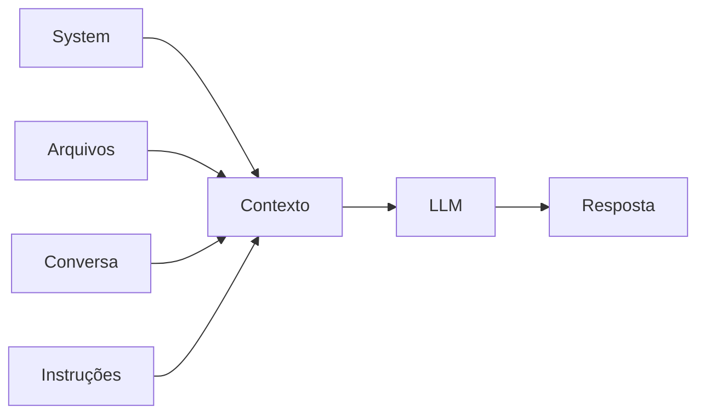

Para firmware, o contexto pode conter:

- especificação;
- `constitution.md`;
- `TARGET.md`;
- drivers;
- testes;
- logs;
- datasheets;
- decisões de arquitetura.

### Problema

**Mais contexto não significa automaticamente melhor resposta.**

Contexto irrelevante pode:

- aumentar custo;
- reduzir eficiência;
- dificultar localização da informação importante.

---

# 6. Custo dos tokens

Em serviços de LLM, o preço normalmente depende dos tokens processados.

Podemos pensar:

```text
Custo ≈ tokens de entrada × preço de entrada
      + tokens de saída × preço de saída
```

Há ainda diferenças entre:

- modelos;
- provedores;
- cache;
- contexto reutilizado;
- capacidade de raciocínio;
- limites de uso.

---
---

## No desenvolvimento embarcado

Um fluxo eficiente tenta:

> **fornecer o contexto necessário, e não todo o repositório indiscriminadamente.**
>
> **Regra de OURO: Prefira arquivos Markdown ou HTML. Evite arquivos binários, imagens e PDFs sempre que houver uma alternativa textual equivalente, pois podem aumentar desnecessariamente o consumo de tokens devido a metadados e conteúdo não textual.**

---
---

# 7. Execução local × provedor

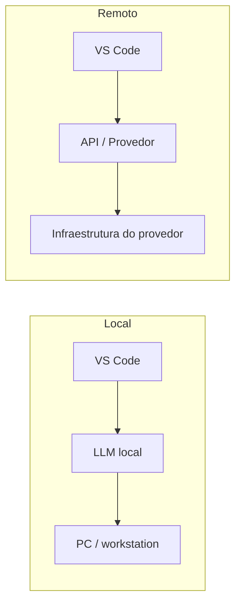

## LLM local

Vantagens:

- dados podem permanecer localmente;
- sem dependência obrigatória de internet;
- controle do modelo;
- possibilidade de custo previsível.

Desvantagens:

- exige hardware;
- modelos maiores podem ser pesados;
- desempenho depende da máquina.

## Provedor

Vantagens:

- modelos muito grandes;
- infraestrutura pronta;
- atualização mais simples.

Desvantagens:

- custo por uso;
- dependência de serviço externo;
- requisitos de política e privacidade.

---

# 8. O que é um Harness?

**Harness = estrutura de suporte para executar, testar, medir e avaliar um sistema de forma controlada.**

No contexto de IA:

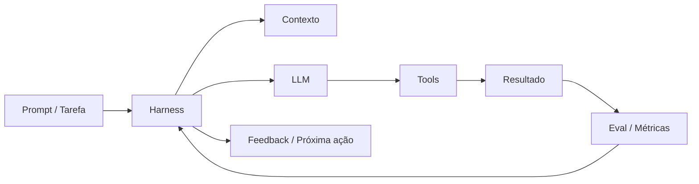

O harness pode controlar ou fornecer:

- prompts e instruções;
- contexto disponível para o modelo;
- regras e políticas;
- skills e procedimentos;
- ferramentas (tools);
- acesso ao filesystem e repositórios;
- terminal e ambiente de execução;
- número e sequência de passos;
- execução de testes;
- compiladores e analisadores;
- simuladores ou hardware de teste;
- métricas de desempenho;
- logs e rastreabilidade;
- critérios de aprovação ou reprovação;
- comparação entre modelos, prompts ou estratégias.

Assim, o harness não é simplesmente o modelo de IA. Ele é o ambiente controlado no qual o modelo trabalha.

### Uma forma simples de visualizar

                 ┌──────────────────────────┐
                 │         HARNESS          │
                 │                          │
                 │  Contexto                │
                 │  Rules                   │
                 │  Skills                  │
                 │  Tools                   │
                 │  Testes                  │
                 │  Métricas                │
                 │  Avaliação               │
                 │                          │
                 │      ┌──────────┐        │
                 │      │   LLM    │        │
                 │      └────┬─────┘        │
                 │           │              │
                 │        Tools             │
                 │           │              │
                 │        Código            │
                 │           │              │
                 │        Testes            │
                 │           │              │
                 │       Resultados          │
                 └───────────┬──────────────┘
                             │
                             ▼
                         Avaliação


### Analogia embarcada

É semelhante a construir um **ambiente de teste reproduzível** para firmware.

Você não pergunta apenas:

> "Funcionou?"

Você pergunta:

> "Em qual cenário, com qual entrada, com qual versão, com qual medição e com qual evidência?"

> Por exemplo:
```
Firmware
   │
   ├── Entrada: 25 °C
   ├── Alimentação: 3,3 V
   ├── MCU: STM32H743
   ├── Firmware: v1.4.2
   ├── Frequência: 400 MHz
   ├── RTOS: FreeRTOS
   ├── Carga: 70 %
   │
   ▼
Teste
   │
   ├── Timing
   ├── RAM
   ├── CPU
   ├── Comunicação
   └── Comportamento
   │
   ▼
Evidências
   │
   ├── PASS
   └── Métricas
```
O harness de IA segue uma lógica semelhante:
```
Tarefa
   │
   ├── Prompt
   ├── Contexto
   ├── Rules
   ├── Skills
   ├── Tools
   └── Modelo
   │
   ▼
Execução
   │
   ├── Código
   ├── Compilação
   ├── Testes
   └── Correções
   │
   ▼
Avaliação
   │
   ├── Resultado
   ├── Métricas
   ├── Custo
   ├── Tempo
   └── Critérios de aceitação
```

---

# 9. Por que Harness importa no embarcado?

Firmware não deve ser avaliado apenas pela qualidade textual do código.

Devemos medir:

- build;
- tamanho de flash;
- RAM;
- tempo de execução;
- latência;
- jitter;
- consumo;
- comportamento após reset;
- comportamento do watchdog;
- comunicação;
- falhas.

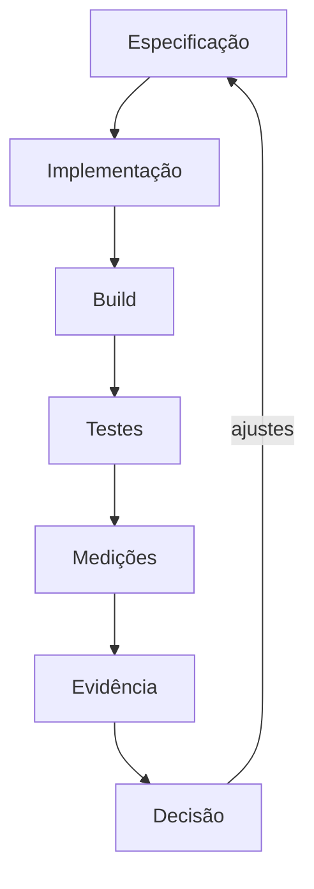

**O harness fecha o ciclo entre intenção e evidência.**

---

# 10. O que é SDD?

## Specification-Driven Development

A especificação é a fonte de intenção.

O código é uma implementação dessa intenção.

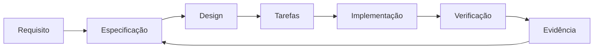

### Importante

SDD não significa:

> "escrever muita documentação".

Significa:

> **definir comportamento observável e mantê-lo conectado à implementação e aos testes.**


---
## Mapa dos artefatos do SDD

Os artefatos não competem entre si: cada um responde a uma pergunta diferente e ajuda o agente a trabalhar com menos ambiguidade.

| Artefato | Pergunta que responde | Exemplo |
|---|---|---|
| **Specification** | O que deve existir? | `REQ-ADC-001`: ler o ADC a cada 1 ms, com resolução de 12 bits e erro máximo de ±2%. |
| **Architecture / Design** | Como o sistema será organizado? | `Application → Control → Drivers → HAL → MCU`; a Application não acessa o ADC diretamente. |
| **Plan** | Como organizar a construção? | Criar interface do ADC → configurar DMA → criar ISR → testar → validar em HIL. |
| **Task / Issue** | Qual trabalho será executado agora? | `TASK-023`: implementar MAX485 em 115200 bps, 8N1, com timeout de 10 ms. |
| **Rules** | Quais restrições são permanentes? | “Usar MISRA-C; nunca usar `malloc`.” |
| **Skills** | Qual procedimento especializado usar? | “Implementar driver SPI para STM32.” |
| **Context** | O que o agente precisa conhecer? | STM32H743, Cortex-M7, 400 MHz, FreeRTOS 11, pinout e datasheet. |
| **Tests / Checks** | Como verificar o resultado? | `test_adc_sampling_rate()` deve comprovar 1000 amostras/s. |

### Artefatos que fecham o contrato

- **Acceptance Criteria:** define quando o requisito está concluído; por exemplo, manter a taxa entre 995 Hz e 1005 Hz durante 60 s.
- **Interfaces / Contracts:** define como módulos conversam; por exemplo, `bool adc_read(adc_sample_t *sample);`.
- **ADR:** registra decisões e motivos; por exemplo, usar DMA em vez de polling para não bloquear a CPU.
- **Examples:** mostram o padrão local; por exemplo, preferir `gpio_write(LED_STATUS, true)` em vez de acessar o HAL diretamente.
- **Checklists / Quality Gates:** impedem concluir com evidência insuficiente; por exemplo, exigir build sem warnings, testes, análise estática, verificação de stack e teste do watchdog.

### Visão do fluxo

```text
Specification → Architecture → Plan → Task
    Rules + Skills + Context orientam a execução
    Code → Tests / Checks → Acceptance Criteria
    ADRs, Examples e Quality Gates preservam decisões e padrões
    Harness fornece ferramentas, compilador, Git e feedback ao agente
```

**Resumo:** Specification define o contrato; Architecture organiza o sistema; Plan e Task orientam a execução; os demais artefatos fornecem restrições, conhecimento, padrões e evidências.

---

# 11. SDD adaptativo

Nem todo problema merece o mesmo processo.

| Escopo | Exemplo | Processo |
|---|---|---|
| Pequeno | corrigir um bug local | `TASK.md` |
| Médio | novo driver conhecido | `spec.md` |
| Grande | protocolo + RTOS + persistência | `spec + design + tasks` |
| Complexo | nova MCU/placa + timing crítico | especificar → pesquisar → projetar → implementar → validar |

### Regra prática

**Aumente o rigor quando aumentarem risco, dependências ou incerteza.**

---

# 12. Arquivos do SDD

O arquivo `SKILL.md` criado propõe uma estrutura organizada:

```text
.specs/
├── project/
│   ├── PROJECT.md
│   ├── ROADMAP.md
│   ├── STATE.md
│   └── constitution.md
├── codebase/
│   ├── STACK.md
│   ├── TARGET.md
│   ├── ARCHITECTURE.md
│   ├── CONVENTIONS.md
│   ├── TESTING.md
│   ├── INTEGRATIONS.md
│   └── CONCERNS.md
└── features/<recurso>/
    ├── spec.md
    ├── context.md
    ├── design.md
    └── tasks.md
```

Para correções pequenas:

```text
quick/NNN-slug/
├── TASK.md
└── SUMMARY.md
```

---

# 13. O papel do `constitution.md`

A constituição define princípios estáveis do projeto.

Exemplos:

- segurança;
- estado seguro;
- determinismo;
- concorrência;
- limites de RAM/flash;
- energia;
- interfaces;
- rastreabilidade;
- diagnóstico;
- recuperação;
- gates.

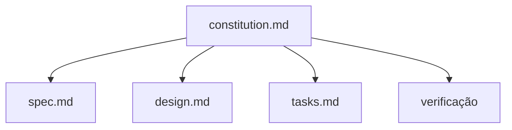

### Ideia-chave

A constituição não descreve cada feature.

Ela define **as regras do jogo**.

---

# 14. O papel do `SKILL.md`

O `SKILL.md` descreve como conduzir o trabalho.

Ele orienta a IA sobre:

- reconhecer o contexto;
- especificar comportamento;
- discutir ambiguidades;
- projetar;
- quebrar em tarefas;
- executar;
- verificar;
- ancorar e encerrar.

### Em outras palavras

`constitution.md`:

> **o que nunca deve ser violado**

`SKILL.md`:

> **como conduzir o processo**


---
## UMA REFLEXÃO: a importância de conhecer a arquitetura da MCU.
### Conhecer a arquitetura de uma MCU é o que diferencia quem apenas gera código com IA de quem constrói firmware profissional.
### A IA é capaz de codificar rápido, mas ela não conhece os limites do seu hardware. Quando você domina conceitos como periféricos, interrupções e memória, consegue aplicar o Spec-Driven Development (SDD) para criar especificações técnicas precisas.
### É essa especificação rigorosa que guia a IA a gerar um código realmente otimizado, seguro e adequado à realidade do chip, evitando bugs críticos de hardware.

---

# 15. Conceito de MCU: o microcontrolador

Uma MCU (Microcontroller Unit)integra vários recursos em um único circuito integrado.

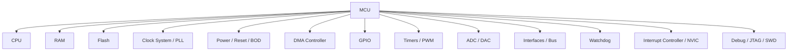

A programação de firmware depende diretamente desses recursos.

---

# 16. CPU: mono core × multi core

## Monocore

Um núcleo de processamento.

```text
Core
 ├─ código
 ├─ ISR
 └─ tasks
```

## Multicore (apêndice B)

Dois ou mais núcleos.

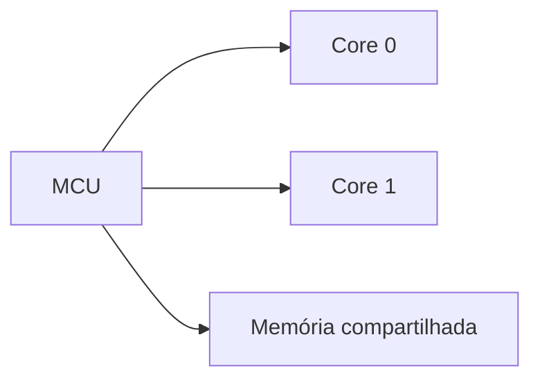

### SDD precisa explicitar

- qual núcleo executa cada tarefa;
- compartilhamento de memória;
- sincronização;
- ownership;
- comunicação entre cores;
- impacto no timing.

---

# 17. Memória: RAM × Flash

## RAM

Normalmente usada para dados durante execução.

Exemplos:

- variáveis;
- stack;
- heap;
- buffers;
- filas.

## Flash

Normalmente usada para:

- firmware;
- constantes;
- configuração persistente;
- dados que precisam sobreviver ao desligamento.

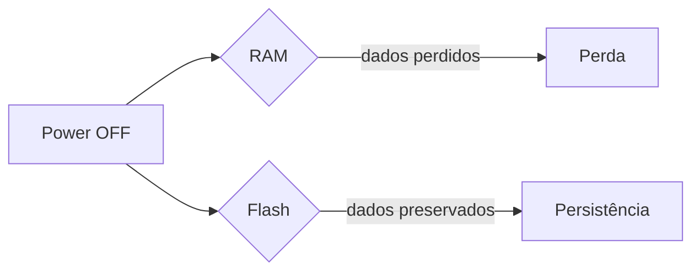

### Em SDD

RAM e flash são **recursos finitos e mensuráveis**.

---

# 18. Persistência de dados

Persistência significa que o dado sobrevive ao reset ou desligamento.

Exemplos:

- calibração;
- configuração;
- contador;
- parâmetros de controle.

Mas escrever em memória não é "grátis".

Precisamos discutir:

- número de ciclos de escrita;
- integridade;
- CRC;
- versionamento;
- atualização atômica;
- recuperação após perda de energia.

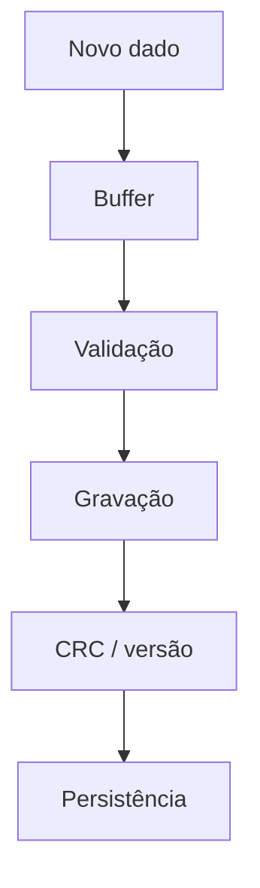

---

# 19. GPIO e portas

GPIO = General Purpose Input/Output.

Podem atuar como:

- entrada digital;
- saída digital;
- funções alternativas.

```text
GPIO
 ├─ INPUT
 ├─ OUTPUT
 └─ Alternate Function
```

### SDD não deve escrever apenas:

> "ligar o sensor no pino X".

Deve haver definição de:

- pino;
- nível elétrico;
- polaridade;
- pull-up/pull-down;
- função;
- frequência;
- comportamento após reset.

---

# 20. Interrupções — ISR

ISR = **Interrupt Service Routine**.

Uma interrupção permite reagir a eventos sem depender exclusivamente do loop principal.

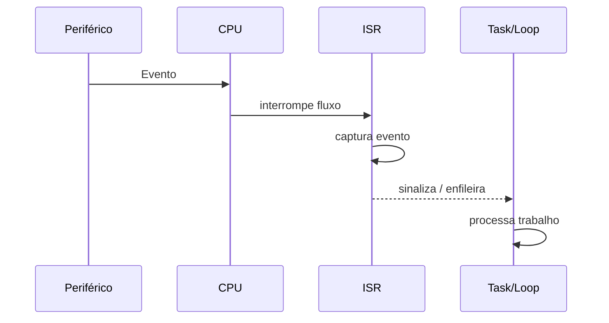

## Regra essencial

A ISR deve ser:

- curta;
- determinística;
- não bloqueante;
- livre de trabalho pesado quando possível.

O `constitution.md` explicita essa preocupação.

---

# 21. Timers, frequência e tempo real

Timers permitem construir eventos temporizados.

Exemplos:

- periodicidade de amostragem;
- PWM;
- timeout;
- contagem;
- scheduler.

### Três conceitos

**Período**

```text
T = 1 / f
```

**Deadline**

Tempo máximo para concluir uma atividade.

**Jitter**

Variação do instante real de execução em torno do instante esperado.

---

# 22. Watchdog, reset e brownout

## Watchdog

Monitora se o software continua respondendo.

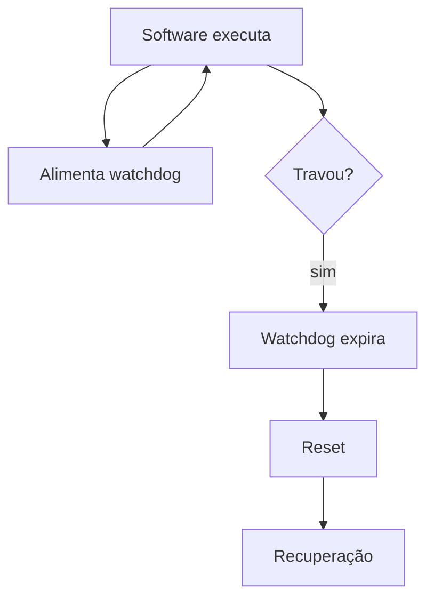

## Reset

Pode ocorrer por:

- power-on;
- watchdog;
- software;
- brownout;
- periférico;
- pino externo.

### SDD

Falha também é comportamento.

---

# 23. Energia

Em embarcados, energia pode ser requisito funcional.

Exemplos:

- corrente máxima;
- duty cycle;
- modo sleep;
- tempo acordado;
- tempo de inicialização;
- autonomia.

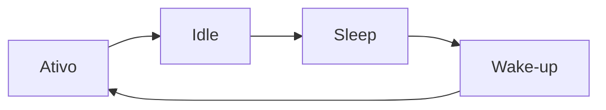

**"Baixo consumo" não é uma especificação.**

Uma especificação deve indicar:

- quanto;
- em qual estado;
- por quanto tempo;
- como medir.

---

# 24. Barramentos e interfaces

### Comunicação interna

- I²C
- SPI
- I²S
- OneWire

### Interfaces digitais / físicas

- GPIO
- PWM
- UART / TTL
- USB
- CAN
- RS-232
- RS-485

### Conversão

- ADC / A/D
- DAC / D/A

Cada interface possui:

- timing;
- níveis elétricos;
- framing;
- erros;
- limites;
- compatibilidade.

---

# 25. TTL não é um protocolo

Esse é um ponto importante.

**TTL** descreve níveis elétricos/lógicos.

**UART** descreve um método de comunicação serial assíncrona.

Portanto:

```text
UART + níveis TTL
```

é diferente de:

```text
UART + transceptor RS-485
```

### Por que isso importa?

Uma LLM pode gerar código UART correto e ainda assim o sistema físico estar errado.

**Software correto não compensa interface elétrica incorreta.**

---

# 26. Interfaces: visão de engenharia

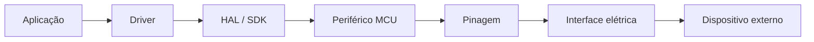

SDD deve registrar o caminho completo.

Exemplo:

```text
FR-012
O firmware deve adquirir temperatura a 10 Hz.

NFR-007
O intervalo entre amostras deve ter jitter <= X.

Design
Timer → ISR → fila → task → driver → ADC/sensor.
```

---

# 27. RTOS (Apêndice C)

Um RTOS organiza execução concorrente em tarefas/threads.

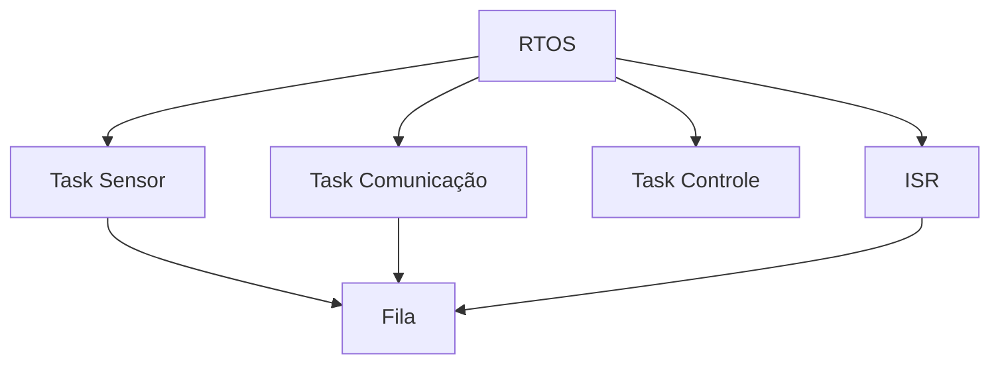

Conceitos importantes:

- task/thread;
- prioridade;
- scheduler;
- fila;
- semáforo;
- mutex;
- evento;
- timeout;
- stack.

### SDD

Descrever apenas "crie uma task" é insuficiente.

É necessário definir:

- finalidade;
- período;
- prioridade;
- deadline;
- recursos compartilhados;
- ownership;
- política de bloqueio.

---

# 28. Máquina de estados

Muitos sistemas embarcados são naturalmente descritos como máquinas de estados.

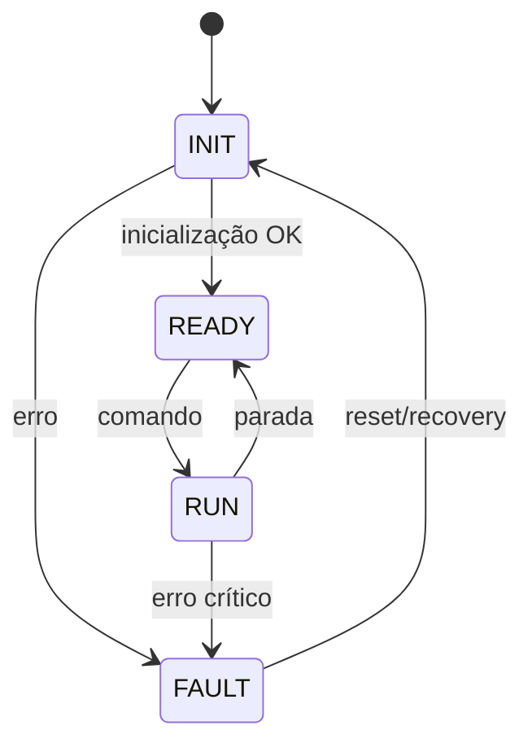

SDD deve tornar explícitos:

- estados;
- eventos;
- transições;
- ações;
- condições de erro;
- estado seguro.

---

# 29. Especificação: comportamento observável

Um requisito bom é testável.

### Ruim

> "O sistema deve ser rápido."

### Melhor

> `NFR-003`: O comando deve ser processado em até 10 ms, medidos da recepção válida até a atualização da saída.

### Critério de aceitação

```text
DADO que o sistema esteja em READY
QUANDO receber um comando válido
ENTÃO deve executar a transição para RUN
E atualizar a saída em até 10 ms.
```

---

# 30.Requisitos Funcionais e Não-Funcionais.

## FR — Functional Requirement

Descreve **o que o sistema faz**.

Exemplo:

```text
FR-021
O firmware deve amostrar o ADC periodicamente.
```

## NFR — Non-Functional Requirement

Descreve restrições mensuráveis.

```text
NFR-021
A frequência de amostragem deve ser 1 kHz ± 1%.
```

Outros NFR:

- latência;
- jitter;
- RAM;
- flash;
- energia;
- disponibilidade;
- segurança;
- diagnóstico.

---

# 31. Design não é a mesma coisa que requisito

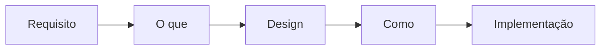

Exemplo:

**Requisito**

> O sensor deve ser amostrado a 100 Hz.

**Design**

> Timer periódico gera evento; ISR coloca timestamp em fila; task realiza aquisição e validação.

O requisito permanece independente da implementação.

---

# 32. E o hardware?

## Aqui está uma fronteira importante

**O assunto é software embarcado.**

Ela **não substitui**:

- especificação elétrica;
- seleção do MCU;
- seleção de componentes;
- projeto esquemático;
- layout PCB;
- integridade de sinal;
- EMC/EMI;
- dissipação térmica;
- fonte de alimentação;
- análise de tolerâncias;
- segurança elétrica.

### SDD deve conhecer o hardware

Mas isso é diferente de afirmar:

> "A IA pode projetar sozinha o hardware."

---

# 33. A ponte entre hardware e software

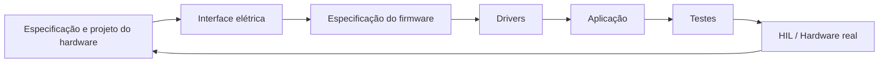

### Regra

Antes de implementar:

> **confirme MCU, placa, clock, alimentação, pinos, periféricos, toolchain, SDK e RTOS.**

O `SKILL.md` chama atenção explícita para não inventar detalhes de hardware.

---

# 34. O arquivo `TARGET.md`

Uma boa ponte entre hardware e software é documentar o alvo.

Exemplo conceitual:

```markdown
# TARGET

- MCU: [fabricante/família/part number]
- Board: [placa/revisão]
- Clock: [frequência]
- Alimentação: [tensão]
- Flash: [capacidade]
- RAM: [capacidade]
- GPIO: [quantidade]
- ADC: [resolução/canais]
- Timers: [quantidade]
- Interfaces: [SPI/I2C/UART/USB/...]
- RTOS: [versão]
- SDK: [versão]
- Toolchain: [versão]
```

### Se não souber

Não invente.

Escreva:

```text
A CONFIRMAR
```

---

# 35. Verificação em níveis

O `SKILL.md` diferencia níveis de evidência:


## HOST

Lógica pura, parser, cálculo, máquina de estados.

## SIMULADOR

Periféricos e temporização modelados.

## BANCADA

Pinos, níveis, sensores, atuadores, reset, watchdog e consumo.

## HIL - Hardware-in-the-loop

Integração com hardware real, timing, comunicação e falhas.

---

# 36. Uma armadilha comum

> "O teste passou no computador, então o firmware está validado."

**Não necessariamente.**

Um teste HOST não prova:

- timing real;
- comportamento da ISR;
- níveis elétricos;
- ruído;
- latência física;
- reset;
- brownout;
- watchdog;
- consumo;
- interação com periféricos reais.

O documento define explicitamente que hardware não deve ser declarado validado apenas por testes HOST.

## Costumo afirmar: a teoria aceita tudo; a simulação aceita quase tudo; a bancada dá falsas esperanças; o teste de campo é onde a realidade cobra a conta.

---

# 37. Rastreabilidade

```mermaid
flowchart TD
    R1[FR-001] --> D1[Design]
    R1 --> T1[Teste]
    T1 --> E1[Evidência]

    R2[NFR-004] --> D2[Design]
    R2 --> T2[Teste]
    T2 --> E2[Medição]
```

A pergunta final é:

> **Consigo apontar para cada requisito e mostrar como ele foi implementado e como foi verificado?**

---

# 38. Exemplo completo: botão + LED

## Requisito

```text
FR-001
Ao pressionar o botão, o LED deve alternar seu estado lógico.

NFR-001
O evento deve ser reconhecido entre 1 ms e 10 ms.

NFR-002
Ruído mecânico não deve gerar múltiplas transições.
```

## Design

```text
GPIO interrupt
      ↓
ISR curta
      ↓
timestamp/evento
      ↓
task/loop
      ↓
debounce
      ↓
toggle LED
```

---

# 39. Exemplo: aquisição de sensor

```mermaid
sequenceDiagram
    participant TIMER as Timer
    participant ISR as ISR
    participant Q as Queue
    participant TASK as Sensor Task
    participant ADC as ADC

    TIMER->>ISR: período
    ISR->>Q: evento
    Q->>TASK: sinal
    TASK->>ADC: inicia aquisição
    ADC-->>TASK: valor
    TASK->>TASK: valida / filtra
    TASK->>TASK: registra timestamp
```

Perguntas SDD:

- Qual frequência?
- Qual resolução?
- Qual faixa?
- Qual tempo de estabilização?
- Qual erro aceitável?
- O que acontece fora da faixa?
- O que acontece se o ADC falhar?
- Onde armazenar os dados?

---

# 40. Como usar o VS Code

A ideia é transformar o repositório em um **ambiente de engenharia**.

```text
projeto/
├── .specs/
│   ├── project/
│   ├── codebase/
│   ├── features/
│   └── quick/
├── src/
├── include/
├── tests/
├── docs/
└── .git/
```

No VS Code:

1. abra o repositório;
2. mantenha a especificação próxima ao código;
3. use o `constitution.md` como regra estável;
4. use o processo do `SKILL.md`;
5. peça à IA para trabalhar sobre uma tarefa específica;
6. revise mudanças;
7. execute os gates;
8. registre a evidência.

Nota: não esqueça de preencher o arquivo `TARGET.md` com informações do hardware e `constitution.md` com regras do projeto.

---

# 41. Fluxo de uma feature no VS Code

```mermaid
flowchart TD
    A[Ideia / necessidade] --> B[classificar risco]
    B --> C{Escopo}
    C -->|Pequeno| D[TASK.md]
    C -->|Médio| E[spec.md]
    C -->|Grande| F[spec + design + tasks]
    C -->|Complexo| G[especificar + pesquisar]
    D --> H[Implementar]
    E --> H
    F --> H
    G --> I[Projetar]
    I --> H
    H --> J[Build]
    J --> K[Testes]
    K --> L[Validação]
    L --> M[Evidence / SUMMARY]
```

---

# 42. Demonstração prática da palestra

## Cenário

> "Implementar no ESP8266 um dashboard web embarcado para exibir temperatura e sinal analógico em tempo real."

### Escopo da demonstração

- MCU: ESP8266
- Sensor de temperatura: DS18B20 em D2 / GPIO4 (OneWire)
- Entrada analógica: A0 com faixa 0 a 1023
- Atualização de aquisição: 1 Hz
- Interface com usuário: servidor HTTP local no próprio MCU

### Requisitos funcionais

- Executar, na inicialização, um scan do barramento OneWire em D2/GPIO4
- Enumerar e registrar no log serial os endereços ROM encontrados
- Identificar sensores DS18B20 pela família OneWire `0x28` e usar o endereço encontrado nas leituras
- Ler o DS18B20 periodicamente e converter para graus Celsius
- Ler A0 periodicamente e manter valor bruto (0 a 1023)
- Expor endpoint JSON com os valores atuais (temperatura e A0)
- Servir página web com dashboard e atualização automática
- Exibir a temperatura e o valor de A0 em indicação numérica
- Exibir a temperatura em um gauge com escala e unidade em graus Celsius com range de 20 a 40 °C
- - Exibir o valor de A0 em um gauge com escala de 0 a 1023
- Exibir gráfico de tendência com o histórico recente das leituras de temperatura e A0 com ranges de 20 a 40 °C e 0 a 1023, respectivamente.
- O layout do dashboard deve ser responsivo e adaptável a diferentes tamanhos de tela e provendo uma experiência de usuário consistente em dispositivos móveis e desktops
- Indicar ausência/falha do DS18B20 sem interromper o dashboard

### Requisitos de rede (modo AP)

- Operar em modo Access Point
- SSID derivado do endereço MAC do ESP8266
    - Exemplo: `ESP8266-1A2B3C` (3 últimos bytes do MAC)
- Wi-Fi sem encriptação (rede aberta)
- Rede local: `192.168.4.0/24`
- IP fixo do MCU/AP: `192.168.4.1`
- Gateway: `192.168.4.1`
- Máscara: `255.255.255.0`
- DHCP do AP deve entregar IP aos clientes nessa sub-rede

### Critérios de aceitação

- Ao energizar, o AP deve ficar visível com SSID baseado no MAC
- Ao conectar ao AP, o cliente deve receber IP da rede `192.168.4.0/24`
- O endereço `http://192.168.4.1` deve abrir o dashboard
- O dashboard deve atualizar automaticamente sem recarregar a página
- O dashboard deve mostrar simultaneamente indicação numérica, gauge e gráfico de tendência
- O gráfico deve receber novos pontos a cada ciclo de aquisição e manter uma janela histórica limitada
- A leitura de A0 deve permanecer no intervalo `0..1023`
- Em falha de leitura do DS18B20, o dashboard deve indicar erro de sensor sem travar a interface

---

# 42A. Use a skill para acelerar SDD

## Recomendação prática

Use a skill especializada para transformar intenção em execução com rastreabilidade.

### Skill sugerida

- `sdd-embarcado`

### Quando acionar

- Ao iniciar uma nova funcionalidade de firmware
- Ao detalhar requisitos de tempo real, segurança e comportamento de falha
- Ao quebrar a implementação em tarefas verificáveis
- Ao preparar testes HOST, bancada e HIL

### Ganhos esperados

- Especificações mais claras antes do código
- Menos retrabalho por ambiguidade de requisitos
- Melhor alinhamento entre firmware, testes e evidências
- Entregas mais previsíveis no ciclo de desenvolvimento

---

# 43. Da demanda para a especificação

Exemplo de `spec.md` para o laboratório:

```markdown
# Dashboard web embarcado — ESP8266

## Objetivo
Adquirir temperatura e sinal analógico e apresentar as leituras em um dashboard web servido pelo ESP8266.

## FR-001 — Scan OneWire
Na inicialização, o firmware deve varrer o barramento OneWire em D2/GPIO4, registrar cada ROM encontrada e identificar a família `0x28` como DS18B20.

## FR-002 — Endereço do sensor
O firmware deve armazenar o endereço ROM do primeiro DS18B20 encontrado e utilizá-lo nas leituras posteriores.

## FR-003 — Aquisição
O firmware deve ler o DS18B20 e A0 a cada 1 s.

## FR-004 — Dashboard
O dashboard deve exibir valor numérico, gauge de temperatura e gráfico de tendência histórica.

## FR-005 — Falha
Se o sensor não for encontrado ou falhar, o dashboard deve indicar o erro e continuar exibindo A0.

## NFR-001 — Rede
O ESP8266 deve operar como AP aberto em `192.168.4.1/24`.

## Critérios de aceitação

DADO o MCU iniciando
QUANDO o scan OneWire terminar
ENTÃO o endereço ROM do DS18B20 deve aparecer no log serial.

DADO uma leitura válida
QUANDO o dashboard for atualizado
ENTÃO os valores numéricos, o gauge e um novo ponto do gráfico devem ser apresentados.
```

---

# 44. Depois vem o design

```markdown
# Design

Timer 1 s
  -> ISR
  -> fila/evento
  -> task de aquisição
  -> driver do sensor
  -> validação
  -> formatter
  -> driver UART
```

### O design responde

- onde executa?
- quem acessa o periférico?
- como dados trafegam?
- qual contexto é ISR?
- qual contexto é task?
- como tratar concorrência?
- qual memória é usada?

---

# 45. Depois vêm as tarefas

Exemplo:

```text
T-001 Criar contrato do driver do sensor
T-002 Implementar timer periódico
T-003 Implementar aquisição
T-004 Implementar validação
T-005 Implementar transmissão UART
T-006 Criar testes HOST
T-007 Executar build do alvo
T-008 Validar na bancada
```

Cada tarefa deve possuir:

- requisitos;
- onde alterar;
- dependências;
- condição de conclusão;
- testes;
- gate.

---

# 46. O que a IA deve receber?

Uma solicitação melhor:

```text
Leia:
- .specs/project/constitution.md
- .specs/codebase/TARGET.md
- .specs/features/temperature/spec.md
- .specs/features/temperature/design.md

Implemente T-003.

Não altere:
- pinagem
- protocolo UART
- contrato do driver

Ao terminar:
1. execute o gate definido;
2. informe arquivos alterados;
3. informe testes;
4. informe desvios da especificação.
```

Isso é muito diferente de:

> "Crie um código para ler temperatura."

---

# 47. SDD + LLM = engenharia com contrato

```mermaid
flowchart LR
    U[Engenheiro] --> S[Especificação]
    S --> L[LLM]
    L --> C[Código]
    C --> V[Verificação]
    V --> E[Evidência]
    E --> U
```

---
# IMPORTANTE

A LLM é um **acelerador de trabalho**.

Ela não substitui:

- decisão de engenharia;
- validação;
- análise de risco;
- conhecimento do hardware;
- medição física;
- responsabilidade técnica.

---

# 48. O que a IA não deve inventar

Segundo o processo proposto:

**Não inventar:**

- MCU;
- placa;
- clock;
- alimentação;
- pinos;
- níveis elétricos;
- periféricos;
- toolchain;
- SDK;
- RTOS;
- protocolo.

Quando faltar informação:

```text
A CONFIRMAR
```

ou uma pergunta bloqueadora.

---

# 49. Segurança e falhas

Em software tradicional, podemos pensar principalmente em:

```text
entrada → processamento → saída
```

No embarcado, precisamos também pensar:

```text
entrada
  ↓
processamento
  ↓
saída
  ↓
falha
  ↓
reset / watchdog / brownout
  ↓
recuperação
  ↓
estado seguro
```

### Falha é comportamento.

Essa é uma das ideias mais importantes da palestra.

---

# 50. O que deve entrar na constituição?

Exemplos:

### Determinismo

- período;
- deadline;
- jitter;
- política de alocação.

### Recursos

- RAM;
- flash;
- stack;
- energia.

### Hardware

- pinos;
- polaridade;
- níveis;
- unidades;
- escalas.

### Comunicação

- framing;
- endianess;
- CRC;
- timeout;
- retries;
- versão.

---

# 51. Gates (apêndice D)

Antes de considerar uma tarefa concluída:

```text
[ ] requisitos observáveis
[ ] alvo confirmado
[ ] toolchain/SDK confirmados
[ ] reset considerado
[ ] watchdog considerado
[ ] timing considerado
[ ] RAM/flash considerados
[ ] energia considerada
[ ] testes executados no nível correto
[ ] resultado registrado
```

### O gate impede o clássico:

> "Compilou, então está pronto."

---

# 52. A diferença entre gerar código e desenvolver firmware

```mermaid
flowchart TD
    A[Gerar código] --> B[Compilar]
    B --> C[Executar]
    C --> D{Funcionou?}

    E[Desenvolver firmware] --> F[Especificar]
    F --> G[Projetar]
    G --> H[Implementar]
    H --> I[Testar]
    I --> J[Medir]
    J --> K[Validar]
    K --> L[Registrar]
```

A segunda abordagem produz **evidência**.

---

# 53. Encerramento: perguntas que sempre devemos fazer

Antes de pedir código:

1. **O que o sistema deve fazer?**
2. **Em quais condições?**
3. **Com quais limites?**
4. **Qual hardware executará isso?**
5. **Qual timing é necessário?**
6. **O que acontece quando falha?**
7. **Como será testado?**
8. **Que evidência provará que está correto?**

---

# 54. Mensagem final

## SDD não é "documentação antes do código".

É uma forma de manter alinhados:

```text
INTENÇÃO
   ↓
ESPECIFICAÇÃO
   ↓
DESIGN
   ↓
IMPLEMENTAÇÃO
   ↓
TESTE
   ↓
EVIDÊNCIA
```

### E, em sistemas embarcados:

> **software, hardware, tempo, memória, energia e falhas fazem parte do problema.**

A IA pode acelerar a engenharia.

**Mas a engenharia continua sendo responsabilidade humana.**
